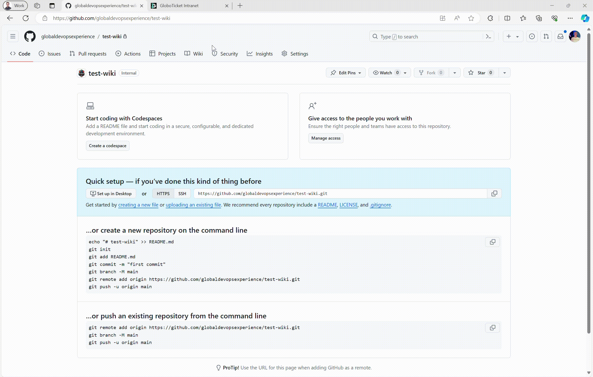
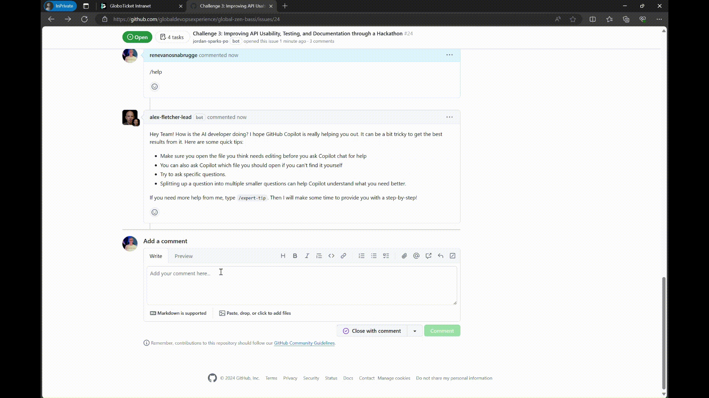

  <main class="relative isolate">
    <!-- Background -->
    

      

    

    <!-- Header section -->
    

      

        <h2 class="text-4xl font-bold tracking-tight text-white sm:text-6xl" id="joinedteam">You just joined a team!</h2>
        
Just some information before we get started.

      

    

    <!-- Content section -->
    

      

        

          

          
You joined a team so it is time to get started. What can you expect when you press the button below to start with the Global DevOps Experience and start the Globoticket intranet

          

            <ul class="list-disc">
              <li>You will land on the Globoticket intranet where you will find a list of news messages. You can open them and read them.</li>
              <li>The top message contains a small arrow next to read more. This is a special message as it is the trigger to start the challenge.</li>
              <li>When you press Mark as Read, you will get a call that you need to answer. Listen to the instructions and press "start challenge"</li>
              <li>You will be navigate to a GitHub repo. We have provisioned a repository, pipelines and full deployed azure enviroment with the running globoticket website at https://.globoticket.com</li>
              <li>Go through the challenge. Ask help by using the GitOps command /help, /expert-tip, /fix, /verify, /finish in the comments of the issue. You can execute the /verify multiple times</li>
              <li>Once done you can start a new challenge on the intranet</li>
              <li>More information you can find in the <a href="#handbook">Participant Manual</a>.</li>
              <li>Have fun!</li>
            </ul>
          

        

        

          <iframe width="560" height="315" src="https://www.youtube-nocookie.com/embed/reoUAScxIUo?si=_VsRML9vbmoC9zxY" title="YouTube video player" frameborder="0" allow="accelerometer; autoplay; clipboard-write; encrypted-media; gyroscope; picture-in-picture; web-share" referrerpolicy="strict-origin-when-cross-origin" allowfullscreen></iframe>
        

      

    

  

  

    

      

        <h2 class="text-3xl font-bold tracking-tight text-white sm:text-4xl">Visit the intranet Start your onboarding today</h2>
        
To get started with the event, visit the intranet.

        

          <a href="https://intranet.globoticket.com" class="rounded-md bg-indigo-600 px-3.5 py-2.5 text-2xl font-semibold text-white shadow-sm hover:bg-indigo-500 focus-visible:outline focus-visible:outline-2 focus-visible:outline-offset-2 focus-visible:outline-indigo-600">Go to the intranet portal</a>
        

      

    
  
  

      

        

      

      

        

          

            

              <h2 class="text-3xl font-bold tracking-tight text-white sm:text-4xl">Participant Manual</h2>
              
Participants will be onboarded as employees of Globoticket, and will also go through the challenges as such. In this manual we describe the flow of the challenges in detail
You can also watch the video that explains this <a href="https://youtu.be/reoUAScxIUo" class="text-blue-600 hover:text-blue-800 underline" target="_blank">here</a>.

            

           

    <h2 class="text-2xl font-bold leading-9 text-white">Register for the event</h2>
    
When you registered for Global DevOps Experience you chose a venue where you want to join. To be able to do that you needed to register with your GitHub Account. This is important! You can only participate in the event when you registered with your GitHub Handle on the <a href="https://www.globaldevopsx.com" class="text-blue-600 underline">Global DevOps Experience website</a>. If you did not do that, please do it, so you can join the event.

    <h2 class="mt-8 text-2xl font-bold leading-9 text-white">Join the event</h2>
    
On event day, you will navigate to the Event Day page. There will be a banner on the homepage of <a href="https://www.globaldevopsx.com" class="text-blue-600 underline">GlobalDevOpsX</a>. Otherwise navigate to this link <a href="https://globaldevopsx.com/event-day" class="text-blue-600 underline">https://www.globaldevopsx.com/event-day</a>.

    <ul class="mt-4 list-disc list-inside text-lg leading-7 text-gray-200">
        <li>There you will see a Big Button, <code class="bg-gray-800 text-white rounded px-1 py-0.5">Join Event</code>.</li>
        <li>Click the button.</li>
        <li>You need to login with your GitHub account that you used for registration.</li>
        <li>Then you will be presented with a number of teams you can join.</li>
        <li>You select a team. Maybe you join a random team, or you will join a team together with others that you agree upon.</li>
        <li>⚠️ You can always come back to this page to select another team. You can only be part of one team, so you will leave the other team.</li>
        <li>When you selected a team, you can <code class="bg-gray-800 text-white rounded px-1 py-0.5">Start the Event</code> by pressing the button.</li>
    </ul>
    
    <h2 class="mt-8 text-2xl font-bold leading-9 text-white">Intermediate page</h2>
    
When you selected a team and it was the first time you did this, you will be presented with some info on the mechanics of the event. Read through the documentation. You can always come back to this page by clicking <code class="bg-gray-800 text-white rounded px-1 py-0.5">Helpdesk</code> button on the Globoticket Intranet.
    When you leave this page, you will be redirected to the <a href="https://intranet.globoticket.com" class="text-blue-600 underline">Globoticket Intranet</a>. You can always navigate there in the browser as well.

    
    <h2 class="mt-8 text-2xl font-bold leading-9 text-white">Globoticket Intranet</h2>
    
On the Globoticket Intranet you can find news of Globoticket. You can also see some buttons on top:

    <ul class="mt-4 list-disc list-inside text-lg leading-7 text-gray-200">
        <li><code class="bg-gray-800 text-white rounded px-1 py-0.5">Helpdesk</code> - This brings you back to the previous page and explains the mechanics and most important commands.</li>
        <li><code class="bg-gray-800 text-white rounded px-1 py-0.5">Scoreboard</code> - it shows the <a href="https://scoreboard.globoticket.com" class="text-blue-600 underline">Scoreboard</a>. It shows your and other teams' score and other.</li>
        <li><code class="bg-gray-800 text-white rounded px-1 py-0.5">Directory</code> - It shows some people from Globoticket.</li>
        <li><code class="bg-gray-800 text-white rounded px-1 py-0.5">News</code> - It shows the news page.</li>
    </ul>
    
The intranet contains news messages. The most important ones are marked with an icon. You can read the news messages. The top messages are most important because they are the start of the challenges. The news provides you with the context.

    
Once you read the context, you can press "Mark as Read". This is the trigger to get started. You will get a call from one of the people at Globoticket with some information on your challenge. Once the person hangs up you can press <code class="bg-gray-800 text-white rounded px-1 py-0.5">Start Challenge</code>. You will be redirected to your Repository on GitHub that is created for you!

    
        <h2 class="mt-8 text-2xl font-bold leading-9 text-white">GitHub Issues</h2>
    
After the call you will be redirected to the GitHub Issues. In the issues you will see an issue <code class="bg-gray-800 text-white rounded px-1 py-0.5">Challenge &lt;number&gt; &lt;Title&gt;</code>. Click the issue and read the instructions.

    
The instructions contain Acceptance Criteria. This is what you need to do!

    
Before you can get more instructions from your colleague Alex Fletcher, there needs to be a Wiki in the repository. You can create this by navigating to Wiki, click <code class="bg-gray-800 text-white rounded px-1 py-0.5">Create the first page</code>. And then press <code class="bg-gray-800 text-white rounded px-1 py-0.5">Save page</code>.

    
    
Shortly after the issue is created and the wiki is present, you will get guidance from Alex Fletcher. He will provide you with instructions.

    
        <h3 class="mt-8 text-xl font-bold leading-8 text-white">Team Info</h3>
    
To make sure all people know where to get their resources, we created a GitHub Issue <code class="bg-gray-800 text-white rounded px-1 py-0.5">Team Info</code>. This contains all secrets, etc. that are needed. THIS IS NOT BEST PRACTICE!!! DO NOT DO THIS NORMALLY!

        <h3 class="mt-8 text-xl font-bold leading-8 text-white">GitOps commands</h3>
    
To make sure you can finish the challenge and be successful, you can put comments in the issue at hand. When you put a comment like below, the people will respond:

    <ul class="mt-4 list-disc list-inside text-lg leading-7 text-gray-200">
        <li><code class="bg-gray-800 text-white rounded px-1 py-0.5">/help</code> - Alex will give a tip or hint. This can be a blog, a link, or just hints.</li>
        <li><code class="bg-gray-800 text-white rounded px-1 py-0.5">/expert-tip</code> - A detailed Wiki page with step-by-step instructions will be presented to finish the challenge.</li>
        <li><code class="bg-gray-800 text-white rounded px-1 py-0.5">/verify</code> - The acceptance criteria will be checked. Jordan Sparks will show what has been checked, what is OK, and what is not OK. Some things cannot be verified. Verify will also add the score to the scoreboard.</li>
        <li><code class="bg-gray-800 text-white rounded px-1 py-0.5">/fix</code> - If people cannot make it, they can use <code class="bg-gray-800 text-white rounded px-1 py-0.5">/fix</code>. A Pull Request with code and instructions will be presented for them to merge.</li>
        <li><code class="bg-gray-800 text-white rounded px-1 py-0.5">/finish</code> - Close the issue, finish the challenge, and go back to the intranet.</li>
    </ul>
        <h2 class="mt-8 text-2xl font-bold leading-9 text-white">Fix Challenge</h2>
    
If you cannot finish, or want to continue, make sure you fix the challenge, as you might need the code from the current challenge. The <code class="bg-gray-800 text-white rounded px-1 py-0.5">/fix</code> command will provide you with a branch, a Pull Request, and instructions to fix the challenge.

    
If you are done, you can run <code class="bg-gray-800 text-white rounded px-1 py-0.5">/verify</code> to see if everything is correct.

    
        <h2 class="mt-8 text-2xl font-bold leading-9 text-white">Finish Challenge</h2>
    
If you are done or want to move on, run <code class="bg-gray-800 text-white rounded px-1 py-0.5">/verify</code>. This does not end the challenge but merely checks your progress. To end the current challenge and move on to the next, type <code class="bg-gray-800 text-white rounded px-1 py-0.5">/finish</code> as an issue comment. This will close the issue, and challenge and allow you to start the next one.

    
        <h2 class="mt-8 text-2xl font-bold leading-9 text-white">Challenges</h2>
    
The challenges are in sequence so you need to go through them all. To give a bit of impression on what you are going to learn:

    <ul class="mt-4 list-disc list-inside text-lg leading-7 text-gray-200">
        <li>Challenge 1 - GitHub Codespaces</li>
        <li>Challenge 2 - Actions and controlled Deployments</li>
        <li>Challenge 3 - Using GitHub Copilot</li>
        <li>Challenge 4 - Using GitHub Advanced Security</li>
        <li>Challenge 5 - Using Semantic Kernel and OpenAI</li>
        <li>Challenge 6 - Using Semantic Kernel and RAG</li>
    </ul>

          

        

  

    <h2 class="text-2xl font-bold leading-10 tracking-tight text-white">Frequently asked questions</h2>
    
Have a different question and can’t find the answer you’re looking for? Reach out to your local proctor.

    

     <dl class="space-y-16 sm:grid sm:grid-cols-2 sm:gap-x-6 sm:gap-y-16 sm:space-y-0 lg:grid-cols-3 lg:gap-x-10">
      

          <dt class="text-base font-semibold leading-7 text-white">We cannot see the wiki?</dt>
          <dd class="mt-2 text-base leading-7 text-gray-300">Our automation created an empty Wiki page for you that will automatically be filled with more instructions. If somehow the wiki is not created, you will be notified by Alex Fletcher with instruction to create the wiki. You can create this by navigating to Wiki, click `Create the first page` . And then press `Save page`.    You can find some more instructions on how to do that <a href="https://docs.github.com/en/communities/documenting-your-project-with-wikis/adding-or-editing-wiki-pages">here!</a></dd>
      

      

          <dt class="text-base font-semibold leading-7 text-white">How can I continue to the next challenge?</dt>
          <dd class="mt-2 text-base leading-7 text-gray-300">The challenges are in sequence and in some cases, you need things from a challenge to be implemented to be able to continue to the next challenge. The best way to move forward is to run the `/fix` command in the comment of your issue. Then a Pull Request will be provided with a branch that contains all the code you need. You can then merge the code to your main branch. Sometimes there are manual instructions you need to complete or a script you need to run to be able to fix it. After that, run the `/finish` command. It will end the challenge and open the next one.</dd>
      

      

          <dt class="text-base font-semibold leading-7 text-white">How do I start a challenge?</dt>
          <dd class="mt-2 text-base leading-7 text-gray-300">The news messages on the <a href="https://intranet.globoticket.com">Globoticket Intranet</a> are the start triggers for the challenges. A news message has an icon next to it. You can read the news message, and press "Mark as Read". This will start a challenge.  </dd>
      

      

          <dt class="text-base font-semibold leading-7 text-white">How do I switch teams?</dt>
          <dd class="mt-2 text-base leading-7 text-gray-300">If you want to switch to another team, you can go back to the Event Day page of the <a href="https://globaldevopsx.com">Global DevOps Experience website</a> and press the button "Join the event". This will show the teams available in the venue. Just select a new team and press "Start the event".  </dd>
      

      

          <dt class="text-base font-semibold leading-7 text-white">What if I don't know how to proceed?</dt>
          <dd class="mt-2 text-base leading-7 text-gray-300">There are multiple self-service help features built into the platform, but there are also proctors in the venue that you can ask to help you out!  
          <code>/help</code> - Alex will give a tip or hint. This can be a blog, a link, or just hints. 
          <code>/expert-tip</code> - A detailed Wiki page with step-by-step instructions will be presented to finish the challenge. 
          <code>/verify</code> - The acceptance criteria will be checked. Jordan Sparks will show what has been checked, what is OK, and what is not OK. Some things cannot be verified. Verify will also add the score to the scoreboard. 
          <code>/fix</code> - If people cannot make it, they can use <code>/fix</code>. A PR with code and instructions will be presented for them to merge. 
          <code>/finish</code> - Close the issue, finish the challenge, and go back to the intranet.</dd>
      

      

          <dt class="text-base font-semibold leading-7 text-white">How does the score work?</dt>
          <dd class="mt-2 text-base leading-7 text-gray-300">
              <ul class="list-disc pl-5">
                  <li>Points will be handed out per team per challenge.</li>
                  <li>Team gets <code>20 points</code> (+20) for every check in the acceptance criteria that is green when doing <code>/verify</code>.</li>
                  <li><code>/help</code> deducts score by 20 points (-20).</li>
                  <li><code>/expert-tip</code> deducts score by 30 points (-30).</li>
                  <li>When using <code>/fix</code> you get 0 points for the challenge.</li>
              </ul>
          </dd>
      

      

          <dt class="text-base font-semibold leading-7 text-white">How do I login to Azure?</dt>
          <dd class="mt-2 text-base leading-7 text-gray-300">Every team has been provided with a GitHub repository with code and pipelines and issues. There is also an Azure environment that has the running Globoticket website. To log in to Azure, you need an Entra ID. The credentials can be found in the GitHub Issue called [Team Info] in your team repository. Typically the username looks like <code>global-team-name@globoticket.com</code> and the password is also stated in that issue.</dd>
      

      

          <dt class="text-base font-semibold leading-7 text-white">How can I get my credentials?</dt>
          <dd class="mt-2 text-base leading-7 text-gray-300">Every team has been provided with a GitHub repository with code and pipelines and issues. There is also an Azure environment that has the running Globoticket website. To log in to Azure, you need an Entra ID. The credentials can be found in the GitHub Issue called [Team Info] in your team repository.</dd>
      

      

          <dt class="text-base font-semibold leading-7 text-white">How can my codespace access all these resources?</dt>
          <dd class="mt-2 text-base leading-7 text-gray-300">When we provisioned your GitHub repository we also added the most important secrets as a codespace secret in your repo settings. This way you can run without any issues.</dd>
      

      

          <dt class="text-base font-semibold leading-7 text-white">How do I get access to OpenAI?</dt>
          <dd class="mt-2 text-base leading-7 text-gray-300">We have a number of OpenAI instances running to use in challenge 5 and 6. To get a key to this, we have a proxy tool to hand out keys in a balanced manner. To get a token from Azure OpenAI we use our own central proxy at <a href="https://openai.globoticket.com/event/2bbe-5922">https://openai.globoticket.com/event/2bbe-5922</a>. You can go to it and authenticate with your GitHub Account. The 'Login in with GitHub' is on the top right. After registering you can scroll down and find the URL and API token you can use to connect to our API.</dd>
      

      

          <dt class="text-base font-semibold leading-7 text-white">How do I get access to Copilot?</dt>
          <dd class="mt-2 text-base leading-7 text-gray-300">We use GitHub Copilot vouchers. We handed out codes to every venue. When you start Challenge 3, instructions will be provided on how to redeem this Copilot voucher and the code that you can use for that.</dd>
      

      

          <dt class="text-base font-semibold leading-7 text-white">Can I run multiple codespaces?</dt>
          <dd class="mt-2 text-base leading-7 text-gray-300">Yes, you can run with multiple participants.</dd>
      

      

          <dt class="text-base font-semibold leading-7 text-white">Should I work alone or in a team?</dt>
          <dd class="mt-2 text-base leading-7 text-gray-300">Global DevOps Experience is all about learning. And the best way to learn is from others. So we highly recommend working in teams. When you work as a team let one person be the driver and solve the challenges with each other. Switch drivers once in a while to let other people participate as well.</dd>
      

      

          <dt class="text-base font-semibold leading-7 text-white">What is Globoticket?</dt>
          <dd class="mt-2 text-base leading-7 text-gray-300">Globoticket is a fictive company that sells concert tickets online. They need to ramp up their business and they want to become a more developer-centric company.</dd>
      

      

          <dt class="text-base font-semibold leading-7 text-white">Who are Emily, Morgan, Robert, Jordan and Alex?</dt>
          <dd class="mt-2 text-base leading-7 text-gray-300">These are fictive personas that work at Globoticket.</dd>
      

      

          <dt class="text-base font-semibold leading-7 text-white">Why is Emily telling me to move on after 40 minutes?</dt>
          <dd class="mt-2 text-base leading-7 text-gray-300">We want you to learn as much as possible. Because a day is short, and we have 6 great challenges for you, we give you a hint after 40 minutes that you can always move on by using the <code>/fix</code> command. This is not required, but merely a heads-up. We want you to see and experience it all!</dd>
      

      

          <dt class="text-base font-semibold leading-7 text-white">I did /fix but my code did not change</dt>
          <dd class="mt-2 text-base leading-7 text-gray-300">The <code>/fix</code> command actually creates a PR and a branch. After running the command, navigate to Pull Request and merge the changes and execute the proposed instructions.</dd>
      

      

          <dt class="text-base font-semibold leading-7 text-white">I added stuff in the repo but I do not see it in the codespace</dt>
          <dd class="mt-2 text-base leading-7 text-gray-300">A codespace is just like a normal IDE connected to Git. To get changes from the repository and to push changes to the repository, you need to do <code>git pull</code> and <code>git push</code>. Just like normal.</dd>
      

      

          <dt class="text-base font-semibold leading-7 text-white">Who are the organizers?</dt>
          <dd class="mt-2 text-base leading-7 text-gray-300">Global DevOps Experience is a community event powered by <a href="https://xebia.com">Xebia</a> and sponsored by GitHub and Microsoft.</dd>
      

      

          <dt class="text-base font-semibold leading-7 text-white">How do I get detailed instructions to fix a challenge?</dt>
          <dd class="mt-2 text-base leading-7 text-gray-300">To get a detailed step-by-step instruction you can run the <code>/expert-tip</code> command in the issue comment.</dd>
      

      

          <dt class="text-base font-semibold leading-7 text-white">Will I get access to this after the event?</dt>
          <dd class="mt-2 text-base leading-7 text-gray-300">No. We provision the materials only on June 15th. It costs a lot of money to keep it up and running.</dd>
      

  </dl>
    

  

  </main>

